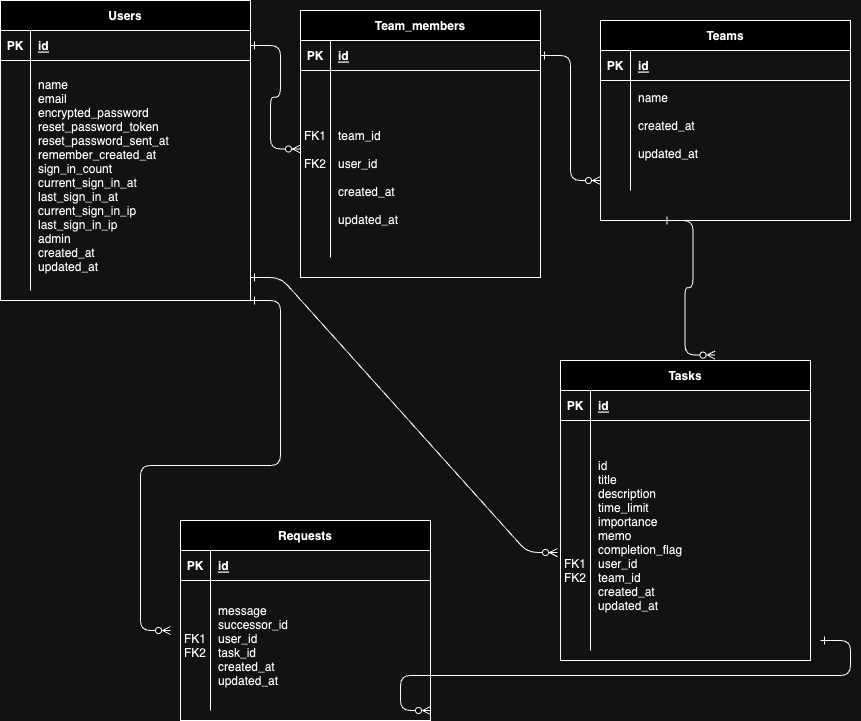
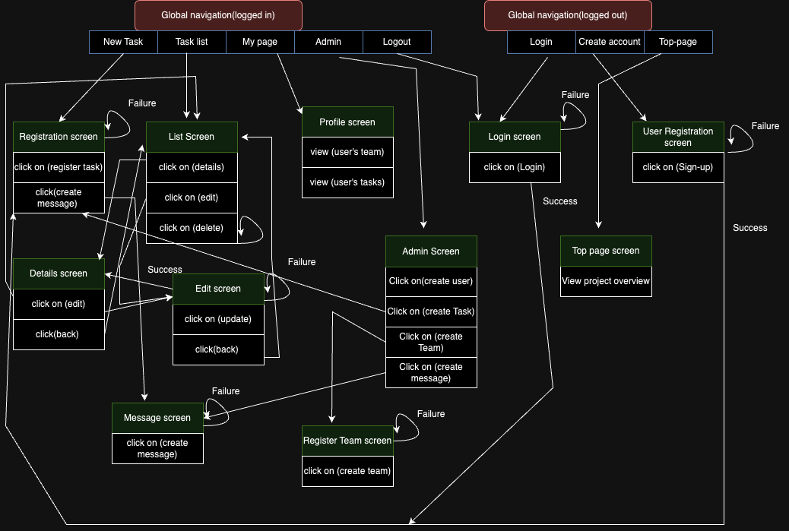

# README

# Langages de développement.
- ruby on rails (6.1.6.1)
- Ruby (3.0.1)

# Execution Procedure
```
git clone git@github.com:username/TrackIt.git
bundle install
rails webpacker:install
rails db:create
rails db:migrate
rails s
```

# Check Sheet, Catalog Design and Table Definition Document


[All links](https://docs.google.com/spreadsheets/d/1GFapGcQtSEERtupQXt2Kn-CiTzkhVphXjq3N12jT0pQ/edit?usp=sharing)

## Wireframe


[Wireframe](https://www.figma.com/file/7I43VumiFxgfyuX1jOWXCF/TrackIt-Wireframe?type=design&node-id=0%3A1&mode=design&t=UQKTEp0Q0lUuJ1lR-1)

## Depot github


[gitclone](https://github.com/aidara2023/TrackIt.git)


# ERD


# SCREEN TRANSITION DIAGRAM
